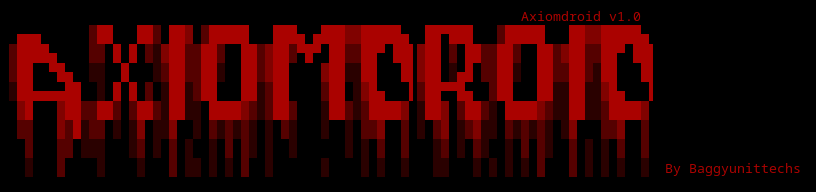
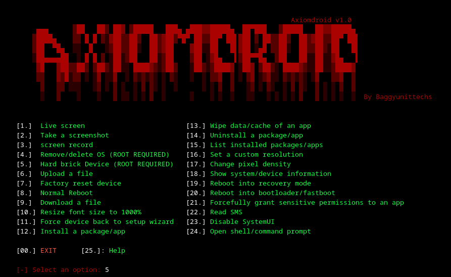

# 🤖 AXIOMDROID V1.0


---
## About AXIOMDROID

**AXIOMDROID** is a **Python-based ADB | SCRCPY AUTOMATION TOOL** designed for:

-  Cybersecurity students  
-  Ethical hacking learners  
-  Python developers learning automation
-  This tool Automates Android Debug Bridge and SCRCPY giving you the ability to controll and android.
- It is currently built for Linux users only. WINDOWS,TERMUX cooming soon.
---

## HOW TO CONNECT YOUR ANDROID PHONE
ADB Automation Tool – Quick User Guide
Educational and Authorized Use Only

Important Notice
This tool uses Android Debug Bridge (ADB).
Use it only on devices you own or have permission to use.
Unauthorized or malicious use may violate privacy laws.

Requirements
- Android phone
- USB cable (required for first-time setup)
- Developer Options enabled

Step 1: Enable Developer Options
1. Settings → About phone
2. Tap Build number 7 times
3. Developer Options will be unlocked

Step 2: Enable USB Debugging
1. Settings → Developer Options
2. Enable USB Debugging
3. (Optional) Enable Wireless Debugging

Step 3: First-Time USB Authorization (Required Once)
1. Connect phone to PC via USB
2. Unlock phone screen
3. Run the tool
4. Choose the first or second option given on the setup wizard
5. When prompted, allow USB debugging and select Always allow

This step is mandatory even if you plan to use wireless or IP mode later.

Running the Tool (Connection Modes)

USB Mode
- Keep USB connected
- Run the tool and select USB mode
- Recommended for first-time users

Wireless Mode
- Phone and PC must be on the same Wi-Fi
- USB authorization must already be done
- Run the tool and select Wireless mode

IP Mode
- For advanced users
- USB authorization must have been completed earlier
- Enter the phone’s local IP address when prompted

Troubleshooting
- Device not detected: unlock phone, reconnect USB, re-enable debugging
- Unauthorized: revoke authorizations and reconnect USB
- Wireless/IP fails: ensure same network and prior USB authorization

---
### INSTALLATION [ LINUX USERS ONLY ]
STEP 1: SCRCPY INSTALLATION \

Ubuntu / Debian (and derivatives: Linux Mint, Pop!_OS)
````bash
    sudo apt update
    sudo apt install scrcpy
````
Fedora
````bash
    sudo dnf install scrcpy
````
Arch Linux / Manjaro
````bash
    sudo pacman -S scrcpy
````
openSUSE (Leap & Tumbleweed)
````bash
    sudo zypper install scrcpy
````
Gentoo
````bash
    sudo emerge --ask media-video/scrcpy
````
Alpine Linux
````bash
    sudo apk add scrcpy
````
The rest of the linux distros
````bash
    flatpak install flathub com.genymobile.scrcpy
````
STEP 2: 
```` bash
   git clone https://github.com/baggyunittechs/AxiomDroid.git
   cd AxiomDroid
   pip install -r requirements.txt
````
STEP 3: RUN
````bash
    python android.py
````
###
NOTE: 
   ANY MISUSE OF THIS TOOL THE AUTHOR IS NOT RELIABLE.
USE THIS TOOL ON A PHONE THAT YOU OWN.
THIS TOOL IS FOR EDUCATIONAL PURPOSE ONLY!!!
### BANNER
